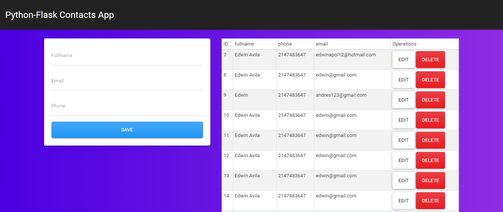

# Screenshot

# install dependencies
- pip install flask
- pip install flask-mysqldb

# issues
- sudo apt-get install libmysqlclient-dev

# link video Tutorial
#- https://www.youtube.com/watch?v=IgCfZkR8wME&t=146s
